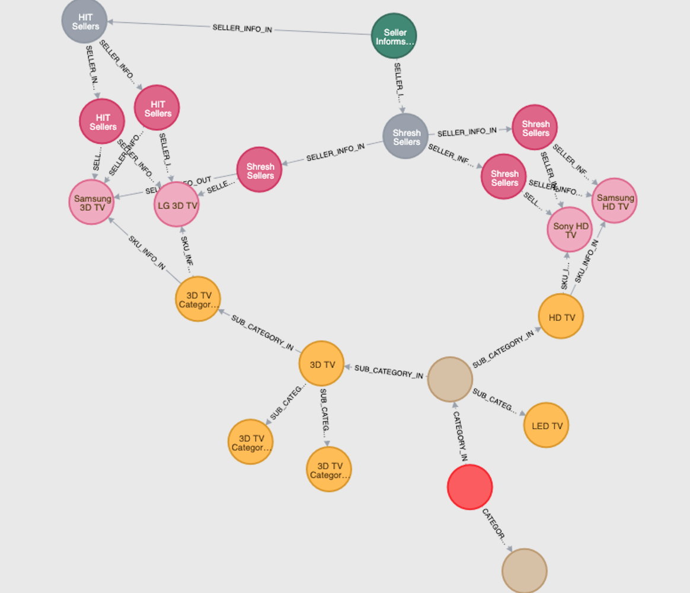

# neo4j-sample-projects

1) start neo4j server 
2) run follwing 

CREATE (TheProduct:Product {title:'The Product', company:'Bizongo' , tagline:'Root Product'})
CREATE (Television:Category {name:'Television' })
CREATE (TheProduct)-[:CATEGORY_IN {info:['Category']}]->(Television)
—RETURN TheProduct ,Television
CREATE (Computer:Category {name:'Computer' })

MATCH (a:Product), (b:Category) WHERE a.title = "The Product" AND b.name = "Computer" 
CREATE (a)-[r:CATEGORY_IN {info:['Category']}]->(b)  
RETURN a,b 

CREATE (HDTV:SubCategory {name:'HD TV' })
CREATE (LEDTV:SubCategory {name:'LED TV' })
CREATE (_3DTV:SubCategory {name:'3D TV' })

MATCH (a:Category), (b:SubCategory) WHERE a.name = "Television" AND  b.name  in ["HD TV","LED TV","3D TV"] 
CREATE (a)-[r:SUB_CATEGORY_IN {info:['SubCategory']}]->(b)  
RETURN a,b

CREATE (SamsungHDSku :Sku {name:'Samsung HD TV' , skucode :'Sam-sku-01'})
CREATE (SonyHDSku:Sku {name:'Sony HD TV' , skucode :'Sony-sku-01'})
CREATE (LGHDSku:Sku {name:'LG HD TV' , skucode :'Lg-sku-01'})

MATCH (a:SubCategory), (b:Sku) WHERE a.name = "HD TV" AND  b.name  in ["Samsung HD TV","Sony HD TV","LG HD TV"] 
CREATE (a)-[r:SKU_INFO_IN {info:['SkuDetail']}]->(b)  
RETURN a,b

CREATE (_3DTV_Sub_Cat_1:SubCategory {name:'3D TV Category-1' , subcategory :'Category-1' })
CREATE (_3DTV_Sub_Cat_2:SubCategory {name:'3D TV Category-2' , subcategory :'Category-2' })
CREATE (_3DTV_Sub_Cat_3:SubCategory {name:'3D TV Category-3' , subcategory :'Category-3' })

MATCH (a:SubCategory), (b:SubCategory) WHERE a.name = "3D TV" AND  b.subcategory  in ["Category-1","Category-2","Category-3"] 
CREATE (a)-[r:SUB_CATEGORY_IN {info:['SubCategory']}]->(b)  
RETURN a,b

CREATE (Samsung3DSku :Sku {name:'Samsung 3D TV' , skucode :'Sam-3D-sku-01'})
CREATE (Sony3DSku:Sku {name:'Sony 3D TV' , skucode :'Sony-3D-sku-01'})
CREATE (LG3DSku:Sku {name:'LG 3D TV' , skucode :'Lg-3D-sku-01'})

MATCH (a:SubCategory), (b:Sku) WHERE a.name = "3D TV Category-1" AND  b.skucode  in ["Sam-3D-sku-01","Sony-3D-sku-01","Lg-3D-sku-01"] 
CREATE (a)-[r:SKU_INFO_IN {info:['SkuDetail']}]->(b)  
RETURN a,b

CREATE (Sellers:Sellers {name:'Seller Informstion' })
CREATE (HITSellers :Seller {name:'HIT Sellers' })
CREATE (SreeshSellers :Seller {name:'Shresh Sellers' })

MATCH (a:Sellers), (b:Seller) WHERE a.name = "Seller Informstion" AND  b.name  in ["HIT Sellers","Shresh Sellers"] 
CREATE (a)-[r:SELLER_INFO_IN {info:['Seller Info']}]->(b)  
RETURN a,b

CREATE (HITSellers_1 :SellerDetail {name:'HIT Sellers' , city : 'Bangalore' , state :'KN' ,area :'Marathahalli' })
CREATE (HITSellers_2 :SellerDetail {name:'HIT Sellers' , city : 'Bangalore' , state :'KN' ,area :'Kormangala' })
CREATE (HITSellers_3 :SellerDetail {name:'HIT Sellers' , city : 'Mumbai' , state :'MH' ,area :'Adheri-E' })
CREATE (HITSellers_4 :SellerDetail {name:'HIT Sellers' , city : 'Mumbai' , state :'MH' ,area :'Adheri-W' })

MATCH (a:Seller), (b:SellerDetail) WHERE a.name = "HIT Sellers" AND  b.name  in ["HIT Sellers"] 
CREATE (a)-[r:SELLER_INFO_IN {info:['Seller Detail Info']}]->(b)  
RETURN a,b 

CREATE (SreeshSellers_1 :SellerDetail {name:'Shresh Sellers' , city : 'Pune' , state :'MH' ,area :'Pune-1' })
CREATE (SreeshSellers_2 :SellerDetail {name:'Shresh Sellers' , city : 'Pune' , state :'MH' ,area :'Pune-2' })
CREATE (SreeshSellers_3 :SellerDetail {name:'Shresh Sellers' , city : 'Pune' , state :'KN' ,area :'Kormangala' })

MATCH (a:Seller), (b:SellerDetail) WHERE a.name = "Shresh Sellers" AND  b.name  in ["Shresh Sellers"] 
CREATE (a)-[r:SELLER_INFO_IN {info:['Seller Detail Info']}]->(b)  
RETURN a,b 

MATCH (a:SellerDetail), (b:Sku) WHERE a.name = "Shresh Sellers" AND  a.state='MH'and  b.skucode  in ["Sam-sku-01","Sony-sku-01"] 
CREATE (a)-[r:SELLER_INFO_OUT {info:["Seller Detail Info"]}]->(b)  
RETURN a,b

MATCH (a:SellerDetail), (b:Sku) WHERE a.name = "Shresh Sellers" AND  a.state=‘KN’ and  b.skucode  in ["Sam-3D-sku-01","Lg-3D-sku-01"] 
CREATE (a)-[r:SELLER_INFO_OUT {info:["Seller Detail Info"]}]->(b)  
RETURN a,b

MATCH (a:SellerDetail), (b:Sku) WHERE a.name = "HIT Sellers" AND  a.state='MH'and  b.skucode  in ["Sam-3D-sku-01","Lg-3D-sku-01"] 
CREATE (a)-[r:SELLER_INFO_OUT {info:["Seller Detail Info"]}]->(b)  
RETURN a,b

MATCH (a:SellerDetail), (b:Sku) WHERE a.name = "HIT Sellers" AND  a.state='KN' and  b.skucode  in ["Sam-3D-sku-01","Lg-3D-sku-01"] 
CREATE (a)-[r:SELLER_INFO_OUT {info:["Seller Detail Info"]}]->(b)  
RETURN a,b

3) Once you download project run mvn clean install

4) run java file SampleNeo4jApplication 

Here are the rest end point 

-> http://localhost:8080/partner?category=3D%20TV
-> http://localhost:8080/partner?category=3D%20TV&State=KN
-> http://localhost:8080/partner?sku=3D%20TV
-> http://localhost:8080/partner?sku=3D%20TV&states=KN
-> http://localhost:8080/product?subcategory=3D%20TV

